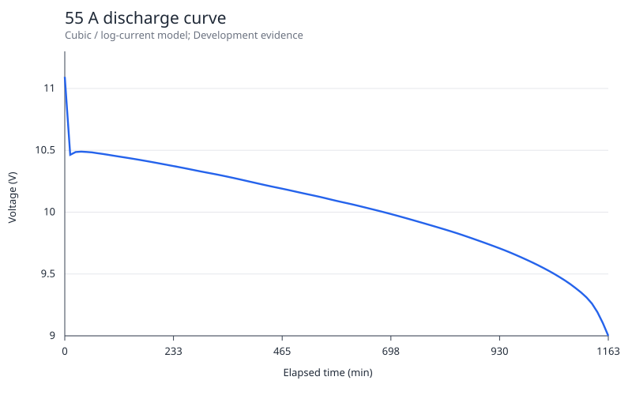

# 2016 C 独立建模结果与证据边界

本报告提交三问的可复算模型结果和部分交接候选。**全题科学状态提议为 PARTIAL / INSUFFICIENT；正式机器 controller 已返回 BLOCK_NATIVE_CONTRACTS。** 当前不是 Final Run，不是 READY_FOR_PAPER_HANDOFF。最终接受判定由主代理在独立原生审核后冻结。

## 实际执行与范围

- Fresh Validation episode 保持原 case ID；官方参考答案始终 SEALED / NOT_ACCESSED。
- 原始工作簿在准备审计中被程序整表物化，部分首尾数据也对建模代理可见，故没有把随后划分的片段冒充严格未见测试集。
- data-sufficiency 实际返回 PARTIAL：第 3 问必要的真实终止标签缺失。允许两个固定 Development 诊断 Run；预测 Final 预算为 0。
- 两个模型 capture 均 SUCCESS，两个独立 checker capture 均 SUCCESS；无失败、无修复重跑。语法、ruff、输入/Git/manifest 检查有真实回执。
- 旧准备草稿因必要证据范围修正进入 STALE，并保留原文、原状态及 Gate 日志。修订 2 没有重置 7200 秒 episode。

## 第 1 问：曲线、误差与剩余时间

设每个电流对应分段多项式为 P_I(t)。区间 j 上使用 U(t)=c3_j(t-x_j)^3+c2_j(t-x_j)^2+c1_j(t-x_j)+c0_j。
选择候选使用 33 个均匀时间索引及最初 31 个采样点的并集作为结点；PCHIP 给出分段三次系数。完整结点和系数见 [q1_piecewise_coefficients.json](candidate_artifacts/q1_piecewise_coefficients.json)。该表示属于分段初等函数，不声称一个低参数全局公式。
PCHIP 的 Hermite/保形性质采用 [SciPy 官方文档](https://docs.scipy.org/doc/scipy/reference/generated/scipy.interpolate.PchipInterpolator.html)，独立 checker 使用手写标量导数与系数公式复核，并用二分反解代替 producer 的多项式求根。

原始曲线初段存在电压回升，不能强行宣称整条实测曲线单调。低电压反解取最后一次向下穿越。

预登记 MRE 实现为 U_k=9+0.005k，k=0,…,230；样本对应时间由相邻原始采样的最后向下线性穿越计算，MRE=mean(|t_model(U_k)-t_sample(U_k)|/t_sample(U_k))。原附件未逐项列出唯一的 231 电压样本列表，因此该公共格点及插值是明确披露的实现解释，不证明它是唯一的逐字解释。

| 电流 A | 三次候选拟合 MRE % | Baseline 拟合 MRE % |
|---:|---:|---:|
| 20 | 0.059976 | 0.349128 |
| 30 | 0.097080 | 0.342451 |
| 40 | 0.111471 | 0.311922 |
| 50 | 0.151977 | 0.410628 |
| 60 | 0.142186 | 0.429490 |
| 70 | 0.038885 | 0.253075 |
| 80 | 0.036627 | 0.214301 |
| 90 | 0.031723 | 0.187956 |
| 100 | 0.032103 | 0.209411 |

九条曲线平均拟合 MRE 为 0.078003%。这些是同一输入曲线的拟合指标，不是新电池的外部预测误差。

9.8 V 时剩余时间 R_I=T_I−P_I^{-1}(9.8)：

| 电流 A | 剩余时间 min |
|---:|---:|
| 30 | 591.678153 |
| 40 | 429.791455 |
| 50 | 326.197390 |
| 60 | 277.936587 |
| 70 | 254.685484 |

## 第 2 问：任意恒流模型与 55 A 曲线

对测得的电流节点直接取 P_I。对相邻节点 L<I<H，令 w=log(I/L)/log(H/L)，T_I=exp((1−w)log T_L+w log T_H)，并定义 U(t,I)=(1−w)P_L(t T_L/T_I)+w P_H(t T_H/T_I)，0≤t≤T_I。该模型只在 20–100 A 范围内使用。
55 A 位于 50、60 A 之间，w=0.522758698863，模型到达 9 V 的总时间 T_55=1162.588117 min。

在 30、40、…、90 A 七个中间电流分别留一电流、用其相邻曲线插值的 Development 诊断中，平均 MRE=1.021976%；Baseline 为 4.893052%。这不是 55 A 的实测误差。

[101 行完整表格](candidate_artifacts/q2_55A_curve.csv)；[各电流诊断误差](candidate_artifacts/q2_loco_summary.csv)。

| 放电时间 min | 模型电压 V |
|---:|---:|
| 0.000000 | 11.093705 |
| 116.258812 | 10.449409 |
| 232.517623 | 10.372540 |
| 348.776435 | 10.286136 |
| 465.035247 | 10.189737 |
| 581.294059 | 10.091167 |
| 697.552870 | 9.984887 |
| 813.811682 | 9.858962 |
| 930.070494 | 9.707416 |
| 1046.329306 | 9.502111 |
| 1162.588117 | 9.000000 |

## 第 3 问：衰减状态 3 的预测

使用新电池、状态 1、状态 2 的完整记录，构造同电压参考时间 m(U)=(t_new(U)+t_1(U)+t_2(U))/3。仅用状态 3 已观测前缀拟合 t_3(U)=a+b m(U)。
本次 a=-1.370765724656 min，b=0.705232734674。最后观测为 9.765 V、596.2 min；预测到达 9 V 的总时间 789.641777 min，**剩余 193.441777 min，约 193.44 min**。

以新电池完整曲线拟合状态 1 前缀、外推状态 1 尾段的 Development 诊断 MRE 为 0.599134%。这只涉及同一电池的另一衰减状态，不能证明状态 3 的实际终止误差。

分别采用三个完整参考得到的剩余时间为 184.826077, 192.963867, 205.475497 min，跨度约 184.83–205.48 min。该区间是参考模型敏感性范围，**不是置信区间或经校准的预测区间**。

预登记输入扰动真实改变拟合前缀：在当前查询时点固定为 596.2 min 时，前缀时间整体加/减 1 min 给出 194.441777/192.441777 min；丢弃最后 10 个前缀观测再拟合给出 191.991785 min。固定查询时点的算法敏感性不等于共同钟表偏移的物理不确定性。

状态 3 的 9 V 真实终止标签没有提供；实际误差为 UNKNOWN。没有造标签、将预测改为描述统计、或用已见数据制造 Final。

## 独立复算与 Gate 结果

独立 checker 没有导入 producer 或共享求解 helper。它复算九条曲线的全部系数、9×231 个逆时间、7×231 个留一电流预测、55 A 的 101 行、三组完整衰减预测及各扰动值。两候选的最大时间向量残差低于 5.51e−11 min，冻结容差为 1e−7 min；逐问 metric 也分别匹配。该独立进程验证算术一致性，不能证明迁移假设，也不是独立 Agent 审核。

| 检查 | 实际结果 | 含义 |
|---|---|---|
| 输入/代码 capture、seal-run、manifest | PASS | 两个真实 Git/输入/输出绑定 Run |
| 独立复算 capture 与残差 | PASS | 表、向量、系数、指标可复算 |
| data-sufficiency | PARTIAL | 状态 3 真实终止证据缺失 |
| compare-check | BLOCK: group_overlap | 同一电池衰减状态存在实体重叠，未虚报独立实体 |
| selection-check | PASS | 固定 Development 评分下的输出绑定有效；不等于科学支持 |
| semantic-check | BLOCK | 缺有效预测 Final、未支持的实际事实；INSUFFICIENT Claim 未伪装成 SUPPORTED |
| completion controller | BLOCK_NATIVE_CONTRACTS | 在总体 data sufficiency Gate 短路停止 |

controller 的 attempts=[] 是在读取 Run registry 前已短路的返回字段；真实两个 capture 由 runs/ 和执行回执证明，不能据此误报零执行。正式 case state 保持 RUNNING；未伪造后续 Final/Handoff 状态。数值 robustness 已按输出契约捕获，但在比较阻断之后没有将第 11 阶段标为正式通过。

## 复现与交接

代码 subject：bee0a94cd0b04a17ceaf80830d482ac91366de1e；远端 pre-run freeze：b71d00fc8944784c5213ba468d3e85afaed47949。
选中 Development Run：RUN-2016-CUBIC-1729；输出 SHA256：a83aba2e542e78ce5d0dcecce98662a2ab39f012086f5807b690fcd8b2531c78。
保留 [机器部分交接候选](candidate_artifacts/partial_handoff_candidate.json)、[逐问语义候选](candidate_artifacts/case_records/evidence/semantic_claim_support_candidate.json)、[完整数值摘要](candidate_artifacts/numerical_summary.json) 和 [阶段日志](stage_journal.json)。
原题/原始工作簿不在发布交接包中；登记保留官方来源、嵌套归档与解压后文件的独立 hash。复现应在另一个专门 replay workspace 中使用冻结前状态与同 hash 原始输入；本 Validation episode 的固定终局候选之后不得重跑。
本题未新增系统包、Python 包、工具链、配置文件或付费 API 调用。
